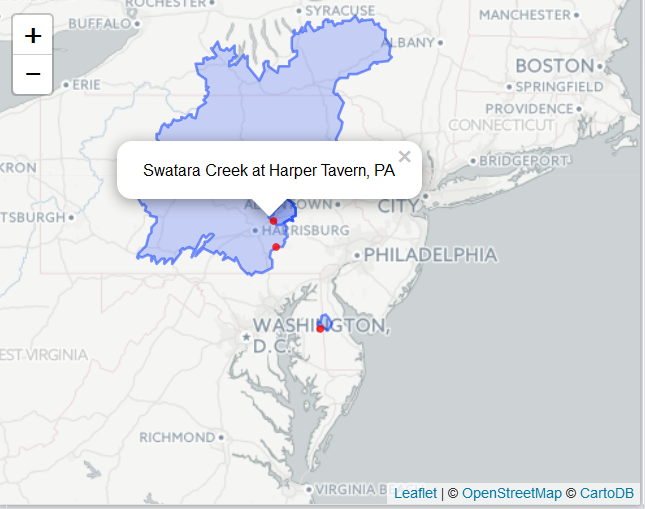

# hydroMap

This package is NOT CURRENTLY supported. 

Please consider using the [NHDPlusTools](https://github.com/usgs-r/nhdplusTools) package. A similar workflow that captures the functions of this package are described here:

[https://usgs-r.github.io/nhdplusTools/articles/plot_nhdplus.html](https://usgs-r.github.io/nhdplusTools/articles/plot_nhdplus.html)


### Package Support

The Water Mission Area of the USGS supported the exploration of the development of the `hydroMaps` R-package. This package is not currently active.

[](https://www.usgs.gov/)

### Sunset date 

There is no current funding for `hydroMaps`. Users should be aware that they use this package at their own risk. 

# Installation

To install the `hydroMap` package, first install the "remotes" package. Then run the following R code:

```{r eval=FALSE}
remotes::install_github("USGS-R/hydroMap")
```

`hydroMaps` depends on the R packages `sp`,`rgeos`, and `rgdal` all of which require an external library gdal to be installed. See :

https://www.mapbox.com/tilemill/docs/guides/gdal/


## Create Interactive Graphs using Leaflet:
```{r message=FALSE, eval=FALSE} 
library(leaflet)
basins <- getBasin(sites)
Range=c(-81,-73,38,44)
flowLines <- getFlowLines(Range, streamorder = 5)

leaflet() %>% 
  addProviderTiles("CartoDB.Positron") %>% 
  setView(-78, 41, zoom = 6) %>%
  addPolygons(data=basins, weight=2, color = "grey") %>%
  addPolylines(data=flowLines, weight=1) %>%
  addCircleMarkers(siteInfo$dec_long_va,siteInfo$dec_lat_va,
                   color = "red",
                   radius=4,
                   stroke=FALSE,
                   fillOpacity = 0.8, opacity = 0.8,
                   popup=siteInfo$station_nm)

```

Screen shot:



## Disclaimer
This software is in the public domain because it contains materials that originally came from the U.S. Geological Survey, an agency of the United States Department of Interior. For more information, see the [official USGS copyright policy](http://www.usgs.gov/visual-id/credit_usgs.html#copyright/ "official USGS copyright policy")

Although this software program has been used by the U.S. Geological Survey (USGS), no warranty, expressed or implied, is made by the USGS or the U.S. Government as to the accuracy and functioning of the program and related program material nor shall the fact of distribution constitute any such warranty, and no responsibility is assumed by the USGS in connection therewith.

This software is provided "AS IS."

 [
    
  ](http://creativecommons.org/publicdomain/zero/1.0/)
