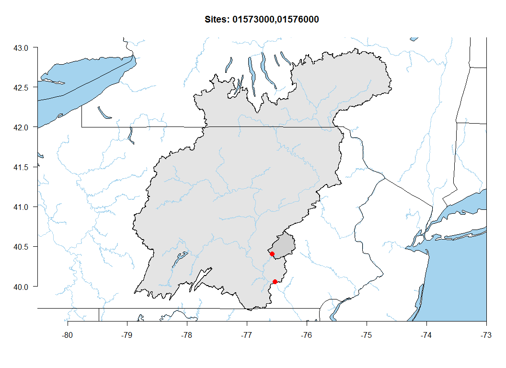
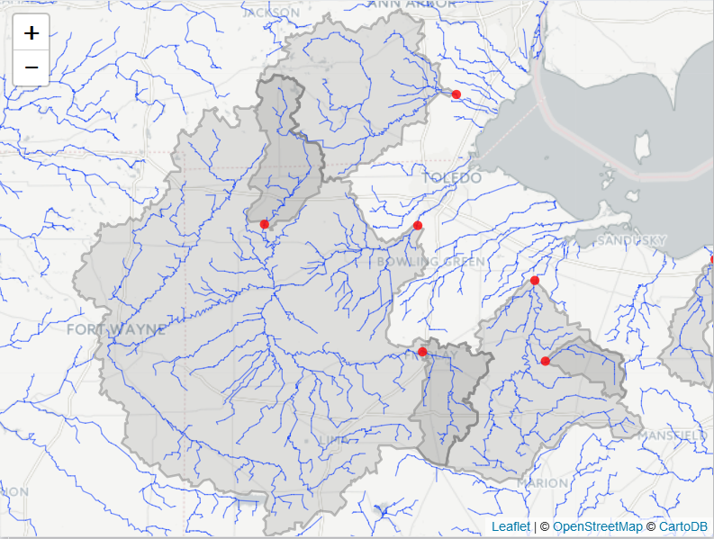

[](https://travis-ci.org/USGS-R/hydroMaps)

Installation
============

Windows
-------

``` r
install.packages("hydroMap", 
    repos = c("http://owi.usgs.gov/R", "http://cran.us.r-project.org"))
```

Mac and Unix
------------

`hydroMaps` depends on the R packages `sp`,`rgeos`, and `rgdal` all of which require an external library gdal to be installed. See :

<https://www.mapbox.com/tilemill/docs/guides/gdal/>

``` r
install.packages("hydroMap", 
    repos = c("http://owi.usgs.gov/R", "http://cran.us.r-project.org"))
```

Sample Workflow
===============

``` r
library(hydroMap)
library(dataRetrieval)
sites <- c("01573000", "01576000")
siteInfo <- readNWISsite(sites)

# png("test.png",width=11,height=8,units="in",res=600,pointsize=4)
plotWSB(sites, mapRange = c(-81,-73,38,44),streamorder = 5)
```

    ## OGR data source with driver: ESRI Shapefile 
    ## Source: "C:\Users\ldecicco\AppData\Local\Temp\2\RtmpIjjOek", layer: "epa_basins"
    ## with 2 features
    ## It has 4 fields

    ## OGR data source with driver: ESRI Shapefile 
    ## Source: "C:\Users\ldecicco\AppData\Local\Temp\2\RtmpIjjOek", layer: "nhdflowline_network"
    ## with 9638 features
    ## It has 89 fields

    ## Warning in readOGR(filePath, layer = "nhdflowline_network"): Z-dimension
    ## discarded

<!-- -->

``` r
# dev.off()
```

Use base R graphics to add information:
---------------------------------------

``` r
plotWSB(sites, mapRange = c(-81,-73,38,44),streamorder = 5)
```

    ## OGR data source with driver: ESRI Shapefile 
    ## Source: "C:\Users\ldecicco\AppData\Local\Temp\2\RtmpIjjOek", layer: "epa_basins"
    ## with 2 features
    ## It has 4 fields

    ## OGR data source with driver: ESRI Shapefile 
    ## Source: "C:\Users\ldecicco\AppData\Local\Temp\2\RtmpIjjOek", layer: "nhdflowline_network"
    ## with 9638 features
    ## It has 89 fields

    ## Warning in readOGR(filePath, layer = "nhdflowline_network"): Z-dimension
    ## discarded

``` r
points(siteInfo$dec_long_va, siteInfo$dec_lat_va, pch=20, col="red", cex=2,streamorder = 5)
```

    ## Warning in plot.xy(xy.coords(x, y), type = type, ...): "streamorder" is not
    ## a graphical parameter

``` r
axis(2,las=1)
axis(1,las=1)
title(paste("Sites:",paste0(siteInfo$site_no,collapse = ",")))
```

<!-- -->

Create Interactive Graphs using Leaflet:
----------------------------------------

``` r
library(leaflet)
basins <- getBasin(sites)
Range=c(-81,-73,38,44)
flowLines <- getFlowLines(Range, streamorder = 5)

leaflet() %>% 
  addProviderTiles("CartoDB.Positron") %>% 
  setView(-78, 41, zoom = 6) %>%
  addPolygons(data=basins, weight=2, color = "grey") %>%
  addPolylines(data=flowLines, weight=1) %>%
  addCircleMarkers(siteInfo$dec_long_va,siteInfo$dec_lat_va,
                   color = "red",
                   radius=4,
                   stroke=FALSE,
                   fillOpacity = 0.8, opacity = 0.8,
                   popup=siteInfo$station_nm)
```

Screen shot: 

Contribute
----------

In order to contribute to this code, we recommend the following workflow:

1.  "fork" this repository to your own personal github account

2.  clone the github repository to your computer:

    $git clone <https://github.com/%7Busername%7D/hydroMaps.git>

3.  modify code or add new functionality, save the code

4.  add the repository master to a remote master called "upstream"

    $cd hydroMaps

    $git remote add upstream <https://github.com/USGS-R/hydroMaps.git>

5.  before pushing your changes to your repository, pull in the current version of the USGS-R master:

    $git fetch upstream

6.  merge these differences with your own "master" version:

    $git merge upstream/master

7.  push your changes to your github repository, in addition to changes made by pulling in the GLEON master:

    $git push

8.  submit a pull request to USGS-R master using your account at github.com

Disclaimer
----------

This software is in the public domain because it contains materials that originally came from the U.S. Geological Survey, an agency of the United States Department of Interior. For more information, see the [official USGS copyright policy](http://www.usgs.gov/visual-id/credit_usgs.html#copyright/ "official USGS copyright policy")

Although this software program has been used by the U.S. Geological Survey (USGS), no warranty, expressed or implied, is made by the USGS or the U.S. Government as to the accuracy and functioning of the program and related program material nor shall the fact of distribution constitute any such warranty, and no responsibility is assumed by the USGS in connection therewith.

This software is provided "AS IS."

[](http://creativecommons.org/publicdomain/zero/1.0/)
